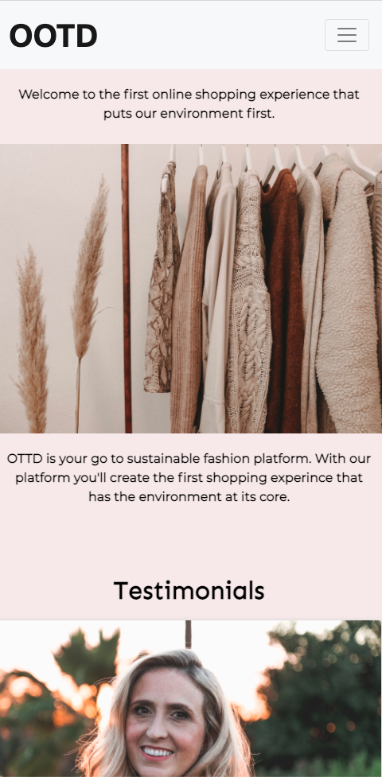

# Code First Girls - final website: OOTD

**Final website for CFG**

##### March 2020

After completing 8 weeks of evening classes where I got an introduction to HTML, CSS and Javascript. I worked in a remote team of two to build this 2-page website using HTML and CSS. We combined a passion for fashion and a passion for environment to create an ecommerce website which discusses the impact of clothing. This was one of my first projects and I learnt lots about Bootstrap. We used it to make our website mobile responsive.

